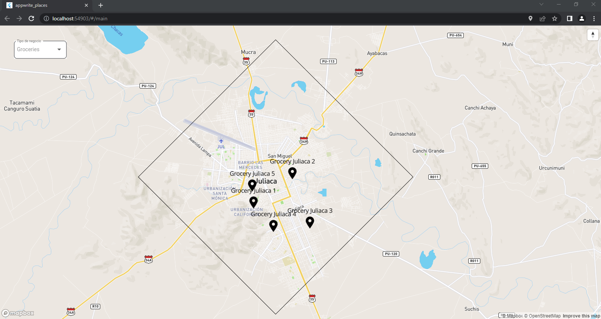

# appwrite_-_places
project presented by Rodolfo Samuel Gavilan Muñoz for the appwrite hackathon.
* clean architecture
* MVVM
* Responsive (mobile and web)

## Get starting
* appwrite v.0.13.4
* flutter v.2.10.5

1. clone project.
2. add the bundle ID to your appwrite project
3. create collections and attributes
    * collections permissions **Document level**

   ## places

   | attributeId   | type      |              |
   |---------------|-----------|--------------|
   |name           | string    |required      |
   |type_business  | string    |required      |
   |latitude       | double    |required      |
   |longitude      | double    |required      |
   

   ## type_business

   | attributeId   | type      |              |
   |---------------|-----------|--------------|
   |name           | string    |required      |
   |description    | string    |required      |

4. create indexes
   ## places

   | attributeId   | type      | attributes   |
   |---------------|-----------|--------------|
   |latitude_longitude_typeBusiness  | key       | latitude (ASC), longitude (ASC), type_business (ASC)    |

5. edit the filename constants.example.dart to constants.dart, fill in your details. the file is located in project/lib/app/constants.example.

## Description
The objective of this project is to explain how to search by latitude and longitude in areas limited by kilometers.

### This project is made from a template made by me. 

[appwrite_template_clean_mvvm](https://github.com/rodgav/appwrite_template_clean_mvvm)

### Contains:
- login
- anonymous session
- forgot password
- create file(unused)
- delete file(unused)

### Functions:
- query for latitude and longitude

### Screenshots

### Attribution of graphic elements used in the project:
- [appwrite](https://appwrite.io/assets)
- [Mark icons created by srip - Flaticon](https://www.flaticon.com/free-icons/mark)

### open source projects used
- [appwrite](https://github.com/appwrite/appwrite)
- [dartz](https://github.com/spebbe/dartz)
- [internet_connection_checker](https://github.com/RounakTadvi/internet_connection_checker)
- [get_it](https://github.com/fluttercommunity/get_it)
- [shared_preferences](https://github.com/flutter/plugins/tree/main/packages/shared_preferences/shared_preferences)
- [rxdart](https://github.com/ReactiveX/rxdart)
- [encrypt](https://github.com/leocavalcante/encrypt)
- [go_router](https://github.com/flutter/packages/tree/main/packages/go_router)
- [intl](https://github.com/dart-lang/intl)
- [flutter_phoenix](https://github.com/mobiten/flutter_phoenix)
- [image_picker](https://github.com/flutter/plugins/tree/main/packages/image_picker/image_picker)
- [build_runner](https://github.com/dart-lang/build/tree/master/build_runner)
- [freezed](https://github.com/rrousselGit/freezed)
- [file_picker](https://github.com/miguelpruivo/flutter_file_picker)
- [geolocator](https://github.com/baseflow/flutter-geolocator/tree/main/geolocator)
- [permission_handler](https://github.com/baseflow/flutter-permission-handler)
- [mapbox_gl](https://github.com/flutter-mapbox-gl/maps)

## Docs
- [flutter documentation](https://flutter.dev/docs).
- [appwrite documentation](https://appwrite.io/docs).

# License

MIT License

Copyright (c) 2022 Rodolfo Samuel Gavilan Muñoz

Permission is hereby granted, free of charge, to any person obtaining a copy
of this software and associated documentation files (the "Software"), to deal
in the Software without restriction, including without limitation the rights
to use, copy, modify, merge, publish, distribute, sublicense, and/or sell
copies of the Software, and to permit persons to whom the Software is
furnished to do so, subject to the following conditions:

The above copyright notice and this permission notice shall be included in all
copies or substantial portions of the Software.

THE SOFTWARE IS PROVIDED "AS IS", WITHOUT WARRANTY OF ANY KIND, EXPRESS OR
IMPLIED, INCLUDING BUT NOT LIMITED TO THE WARRANTIES OF MERCHANTABILITY,
FITNESS FOR A PARTICULAR PURPOSE AND NONINFRINGEMENT. IN NO EVENT SHALL THE
AUTHORS OR COPYRIGHT HOLDERS BE LIABLE FOR ANY CLAIM, DAMAGES OR OTHER
LIABILITY, WHETHER IN AN ACTION OF CONTRACT, TORT OR OTHERWISE, ARISING FROM,
OUT OF OR IN CONNECTION WITH THE SOFTWARE OR THE USE OR OTHER DEALINGS IN THE
SOFTWARE.